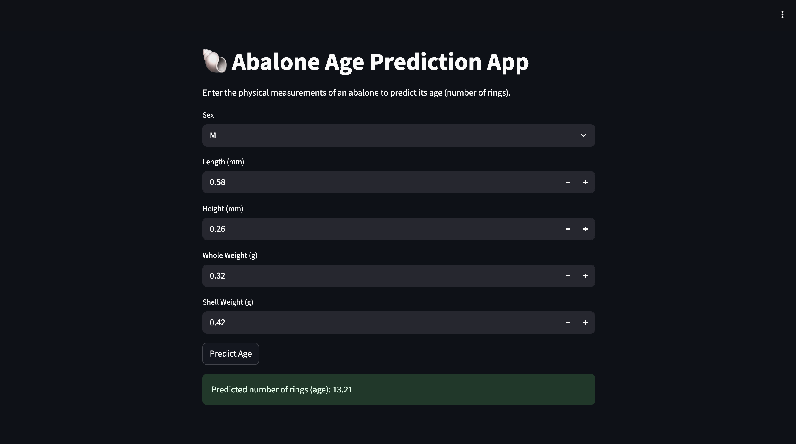

# 🐚 Abalone Age Prediction using Machine Learning  

## 📌 Project Overview  
Predicting the age of abalones (a type of sea snail) is important for marine biology and commercial purposes. Traditionally, age is estimated by cutting the shell and counting growth rings through a microscope — a time-consuming and destructive method.  

This project builds a **Machine Learning Model** that predicts the age of abalones using physical measurements (e.g., length, weight, shell size). The solution is deployed on **Streamlit Cloud** and **Render** so anyone can try it online.

---

## 🚀 Live Demo  

- [🌍 Render App](https://abalone-age-predictor-z867.onrender.com)  
- [⚡ Streamlit Cloud App](https://supervisedml--abalone-dw7ulskbtiedqoqgtppg44.streamlit.app/)  

### Demo Screenshots / Videos  

---

## 📂 Table of Contents  
1. [Dataset](#-dataset)  
2. [Project Workflow](#-project-workflow)  
3. [Installation & Usage](#-installation--usage)  
4. [How to Use the App](#-how-to-use-the-app)   
5. [Tech Stack](#-tech-stack)    
6. [License](#-license)  

---

## 📊 Dataset  
- **Source:** [UCI Machine Learning Repository – Abalone Dataset](https://archive.ics.uci.edu/ml/datasets/abalone)  
- **Description:**  
  - Features: Sex (M/F/I), Length(mm), Diameter(mm), Height(mm), Whole weight(g), Shucked weight(g), Viscera weight(g), Shell weight(g).  
  - Target: Number of Rings → converted to **Age = Rings + 1.5** years.  

---

## ⚙️ Project Workflow  
1. **Data Collection** → Downloaded from UCI repository.  
2. **Data Preprocessing** → Encoded categorical features, scaled numerical values.  
3. **Model Training** → Trained regression models to predict age.  
4. **Model Evaluation** → Evaluated using MAE, RMSE, and R².  
5. **Deployment** → Deployed with **Streamlit** on Streamlit Cloud & Render.  

---

## 💻 Installation & Usage  

Clone the repository:  
`bash
git clone git@github.com:Calaabdul/Abalone_age_prediction.git
cd abalone-age-prediction`

Run locally with Streamlit:
`streamlit run app.py`

Or access the live demos above.

## 🖱️ How to Use the App

- Open the deployed app on Render or Streamlit Cloud.
- Enter the physical measurements of an abalone (Length, Diameter, Weight, etc.).
- Click Predict.

The model will output the estimated age (in years) of the abalone.

👉 Example Screenshot:

## 🛠 Tech Stack

Language: Python 3.9+

Libraries: Pandas, NumPy, Scikit-learn, Streamlit, Matplotlib/Seaborn

Deployment: Streamlit Cloud, Render

## Create a virtual environment and install dependencies:
`pip install -r requirements.txt`

## License
This dataset is licensed under a Creative Commons Attribution 4.0 International (CC BY 4.0) license.
This allows for the sharing and adaptation of the datasets for any purpose, provided that the appropriate credit is given.
